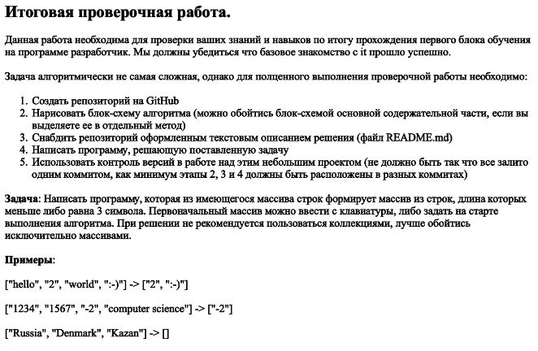
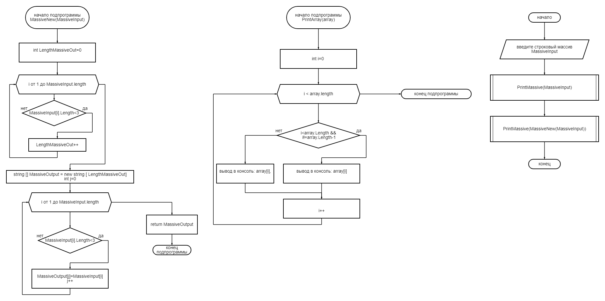

**Алгоритм решения итоговой задачи:**

Этот документ содержит письменный алгоритм решения следующей задачи:

Входными данными является исходный массив, который задается вводом элементов через запятую в консоль.

Задача решается в два шага:

1. Надо определить количество элементов, длина которых меньше 3 - это будет длина нового массива, содержащего эти элементы

2. поместить в новый массив эти элементы.

ну, и, вспомогательно: напечатать (подпрограмма печати массива) в консоль этот полученный массив.

Результат данного алгоритма показан на блок-схеме:

